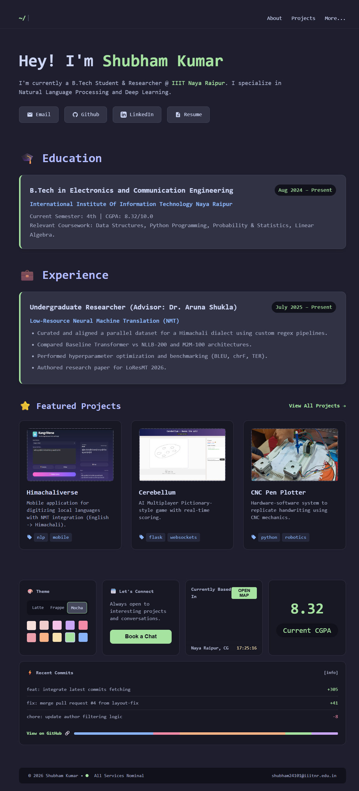
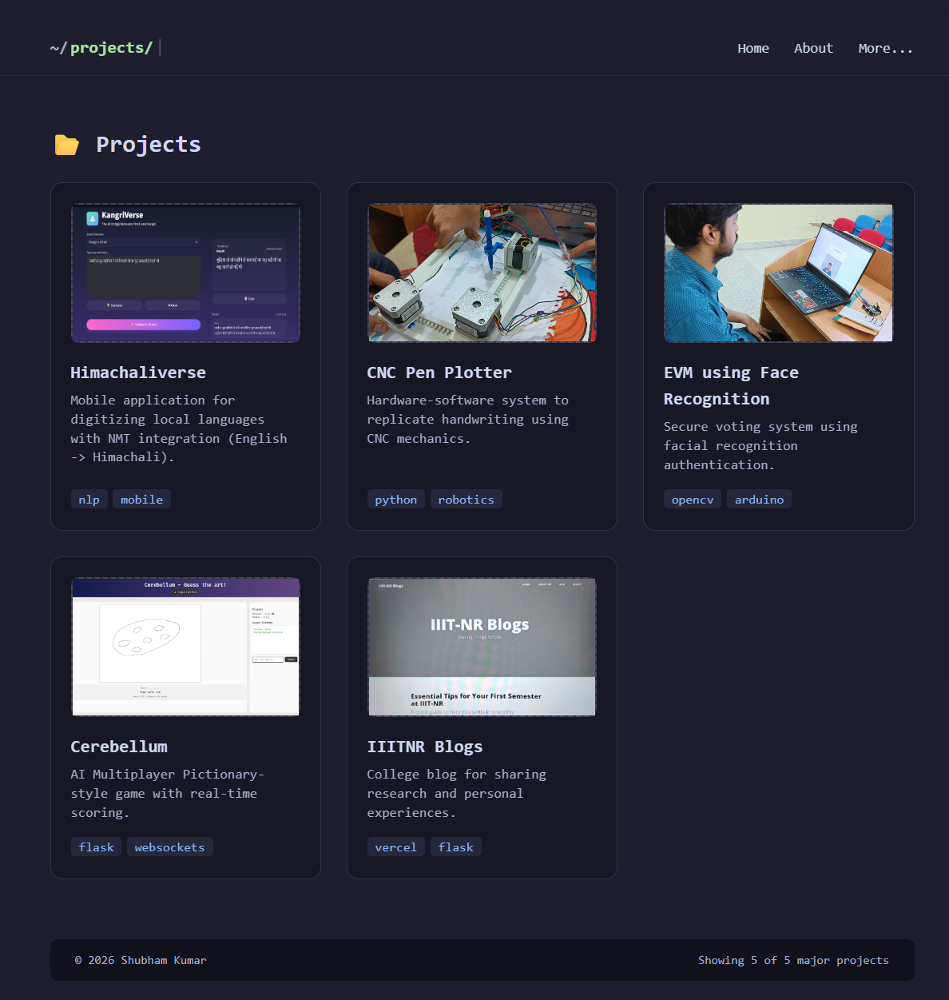

# 👨‍💻 Shubham Kumar | Portfolio

[](https://cosmicshubham1.github.io/PortfolioShubham/)
[](https://github.com/CosmicShubham1/PortfolioShubham)

Welcome to my personal portfolio repository! This static website showcases my journey as an **Electronics & Communication Engineer** specializing in **NLP**, **AI Systems**, and **Full-Stack Development**.

It features a clean, responsive "dark mode" aesthetic with a custom theme toggle (Latte / Frappe / Mocha).

---

## 📸 Portfolio Previews

| **Home** | **Projects** |
|:---:|:---:|
|  |  |

---

## 🚀 About Me

I am an Undergraduate Researcher at **IIIT Naya Raipur**, bridging the gap between deep learning theory and deployment. My work focuses on **Low-Resource Neural Machine Translation (NMT)** and scalable AI architectures.

* **🎓 Education:** B.Tech in ECE, IIIT Naya Raipur (CGPA: 8.32)
* **🔬 Research:** Low-Resource NMT for Himachali Dialects
* **🏆 Achievement:** **IOQM Qualified (Class 10)** – Qualified for the Indian Olympiad Qualifier in Mathematics, a prestigious national-level examination recognizing advanced mathematical talent.

---

## 🛠️ Tech Stack

**Languages & Frameworks:**


**Tools & Platforms:**


---

## 📂 Featured Projects

| Project | Tech Stack | Description |
| :--- | :--- | :--- |
| **Himachaliverse** | `NLP` `Python` `Transformers` | A Neural Machine Translation system for digitizing low-resource Himachali dialects using NLLB-200. |
| **Cerebellum** | `Flask` `WebSockets` `Game Dev` | A real-time multiplayer "Pictionary" style game with event-driven state management and tiered scoring. |
| **CNC Pen Plotter** | `Robotics` `Arduino` `G-Code` | A 3-axis automated hardware system that replicates digital vector graphics onto physical paper. |
| **EVM Face Recognition** | `OpenCV` `Biometrics` `Security` | An offline electronic voting machine integrating facial authentication to prevent voter fraud. |
| **IIIT-NR Blogs** | `Full-Stack` `TiDB Cloud` | A dynamic CMS for the college community backed by distributed SQL cloud infrastructure. |

---

## ⚡ How to Run Locally

If you want to view or modify the portfolio source code on your machine:

1.  **Clone the repository**
    ```bash
    git clone [https://github.com/CosmicShubham1/PortfolioShubham.git](https://github.com/CosmicShubham1/PortfolioShubham.git)
    ```
2.  **Navigate to the folder**
    ```bash
    cd PortfolioShubham
    ```
3.  **Launch**
    * Simply open `index.html` in your browser.
    * OR use the Live Server extension in VS Code for hot-reloading.

---

## 📬 Connect

* **Email:** shubham24101@iiitnr.edu.in
* **LinkedIn:** [Shubham Kumar](https://www.linkedin.com/in/cosmicshubham/) 
* **GitHub:** [CosmicShubham1](https://github.com/CosmicShubham1)

---
<p align="center">Made with ❤️ by Shubham Kumar</p>